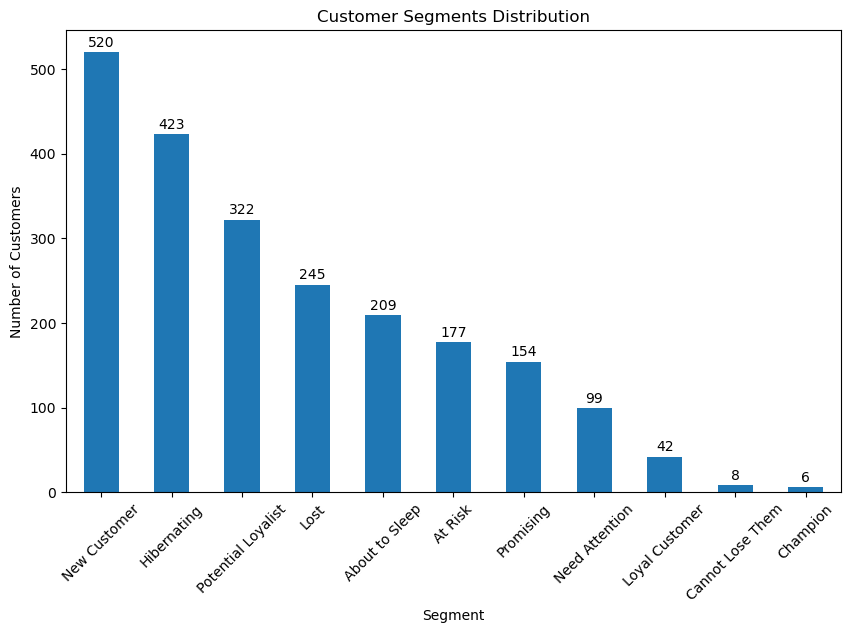
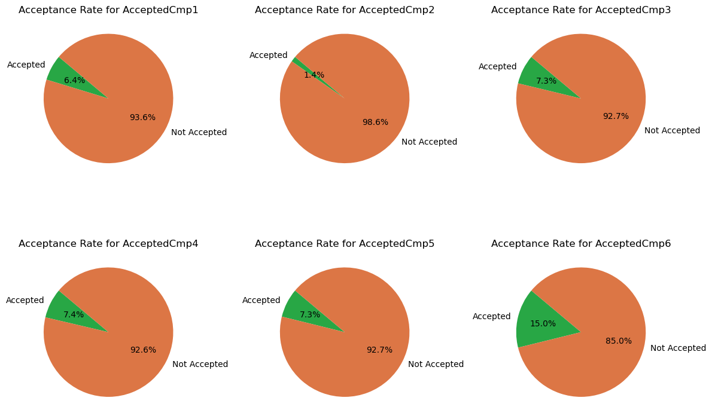
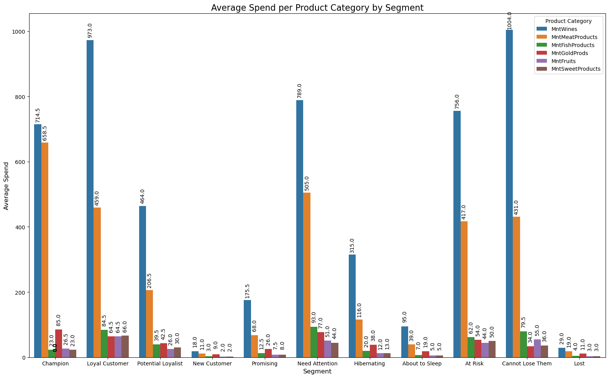

# Supermarket Campaign Analysis

## Overview

This project provides an in-depth analysis of supermarket customer behavior and the effectiveness of marketing campaigns using **RFM (Recency, Frequency, Monetary)** segmentation. The analysis helps evaluate past campaigns, understand customer segments, and identify product preferences. By doing so, this project aims to optimize future marketing strategies and improve customer retention.

## Table of Contents

- [Project Overview](#overview)
- [Objective](#objective)
- [Installation](#installation)
- [Dataset](#dataset)
- [Methodology](#methodology)
  - [Data Cleaning](#data-cleaning)
  - [RFM Segmentation](#rfm-segmentation)
  - [Campaign Performance Analysis](#campaign-performance-analysis)
  - [Customer Segmentation](#customer-segmentation)
  - [Product Preference Analysis](#product-preference-analysis)
- [Insights](#insights)
- [Visualizations](#visualizations)
- [Conclusion](#conclusion)
- [Future Improvements](#future-improvements)
- [Contributing](#contributing)

## Objective

The main objective of this project is to leverage RFM segmentation to:

- Analyze customer behavior.
- Evaluate marketing campaign performance.
- Optimize future campaigns based on customer segmentation and preferences.

## Installation

To run this project, you’ll need the following Python libraries:

```bash
pandas
numpy
matplotlib
seaborn
scikit-learn
```

You can install them using `pip`:

```bash
pip install pandas numpy matplotlib seaborn scikit-learn
```

To run this project locally, follow these steps:

1. Clone the repository:

   ```bash
   git clone https://github.com/cahayatambunan/Supermarket_Campaign_Analysis.git
   ```

2. Navigate to the project folder:

   ```bash
   cd Supermarket_Campaign_Analysis
   ```

3. Run the Jupyter notebook or Python script that contains the analysis:

   ```bash
   jupyter notebook Supermarket_Campaign_Analysis.ipynb
   ```


## Dataset

The dataset used for this project includes anonymized transaction and campaign data from a supermarket. The data consists of:

- Customer transaction records (date, product, quantity, amount spent).
- Campaign performance (response rates, customer interactions).
- Customer demographics and segmentation.

## Methodology

### 1. Data Cleaning
- Remove duplicate records and handle missing values.
- Standardize date and numerical formats for consistency.

### 2. RFM Segmentation
We calculated the following for each customer:
- **Recency**: How recently the customer made a purchase.
- **Frequency**: How often the customer made a purchase.
- **Monetary**: How much the customer has spent.

Based on these three factors, customers were grouped into segments such as *best customers*, *loyal customers*, and *at-risk customers*.

### 3. Campaign Performance Analysis
- Evaluated the success of each marketing campaign by analyzing response rates, purchase behavior post-campaign, and revenue generated.
- Identified which segments responded best to different types of campaigns (e.g., discounts, personalized offers).

### 4. Customer Segmentation
- Customers were segmented based on their RFM scores.
- Segments were analyzed to understand the characteristics of different customer groups, such as spending habits and campaign responsiveness.

### 5. Product Preference Analysis
- Analyzed the most popular products among different customer segments.
- Provided insights on which product categories performed best during campaigns.

## Insights

Some key findings from the analysis:
- **Loyal customers** tend to respond better to loyalty rewards programs, while **at-risk customers** respond well to flash sales or discounts.
- **Best customers** are more likely to purchase high-value products and respond to personalized marketing efforts.
- **RFM analysis** helps identify customer segments that require different strategies to boost retention and drive sales.

## Visualizations

Here are some visualizations from the analysis:

### 1. RFM Segmentation Plot
This plot visualizes customer segments based on their RFM scores.



### 2. Campaign Response Rates
The following chart shows how different customer segments responded to various campaigns (e.g., discounts, personalized offers).



### 3. Product Preferences by Customer Segment
This bar chart illustrates which product categories were most popular among different customer segments.



## Conclusion

This project shows that **RFM segmentation** is an effective tool for analyzing customer behavior and optimizing marketing strategies. By understanding the behavior of different customer segments, supermarkets can tailor campaigns that maximize customer retention and drive revenue.

## Future Improvements

- Implement machine learning models to predict customer churn based on past behavior.
- Integrate additional demographic data to further refine customer segmentation.
- Explore A/B testing to evaluate the effectiveness of different marketing strategies on various customer segments.

## Contributing

Contributions are welcome! If you would like to contribute to the project, feel free to fork the repository and create a pull request with your changes. Be sure to follow the style and format of the existing code.
